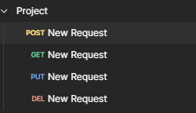
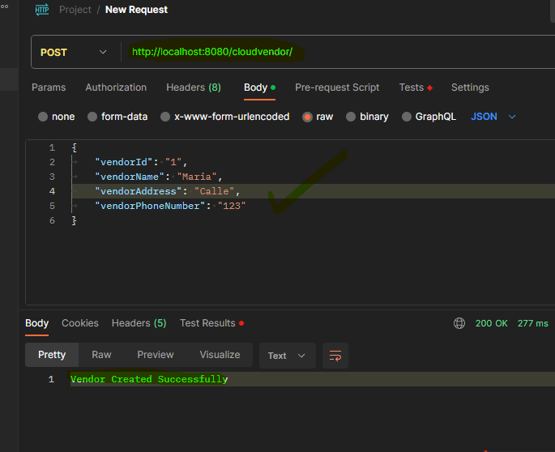
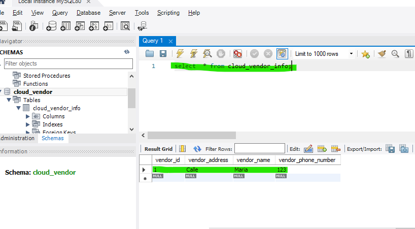
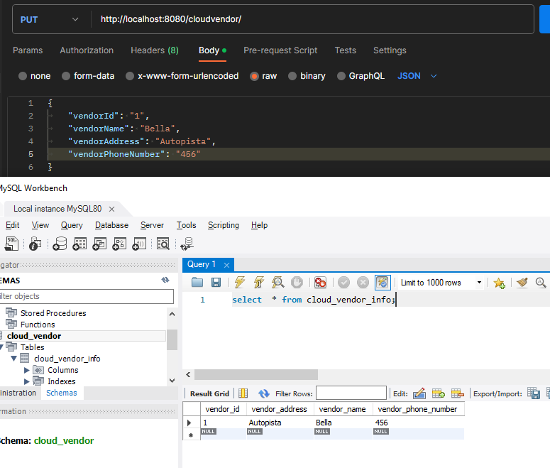

# Spring Boot, MySQL, Rest API

Diseño y desarrollo de servicios web - Proyecto GA7-220501096-
AA5-EV03

## Tabla de contenido

- [Inicio](#Inicio)
- [Demostracion](#Demostracion)

## Inicio

**1. Clonar**

```bash
git clone https://github.com/camila-barona1/rest-api-spring-boot-mysql.git
```

**2. Crear Mysql database**
```bash
create database cloud_vendor
```


**3. Cambiar mysql username y password**

+ open `src/main/resources/application.yaml`

**4. Run**

La app iniciara en <http://localhost:8080>

## Demostracion

Este projecto evidencia lo siguiente
- CRUD (Post - Get - Put - Del)
- 

- Requests provados con Postman para validar cada metodo
- 

- Conexion establecida con base de datos Mysql
- 

- Demostracion de un request PUT (para actualizacion de datos) y un query para validar que la informacion haya cargado correctamente
- 



